# DevSecOps - Projeto Wordpress na AWS

 **Documentação do segundo projeto proposto na trilha de DevSecOps no meu programa de estágio PB - 2025**  

## 🎯 Objetivo  
1. Implementar um ambiente seguro e escalável para hospedagem de um site WordPress na AWS

2. Garantir alta disponibilidade e desempenho do site utilizando serviços da AWS

## Etapas
1. Instalação e configuração do DOCKER ou CONTAINERD no host EC2;
- Ponto adicional para o trabalho utilizar
a instalação via script de Start Instance (user_data.sh);
- Seguir o desenho da topologia disposta;

2. Efetuar Deploy de uma aplicação Wordpress com:
- Container de aplicação;
- RDS database Mysql;

3. Configuração da utilização do serviço EFS AWS para estáticos do container de aplicação Wordpress

4. Configuração do serviço de Load Balancer AWS para a aplicação Wordpress

## Topologia 
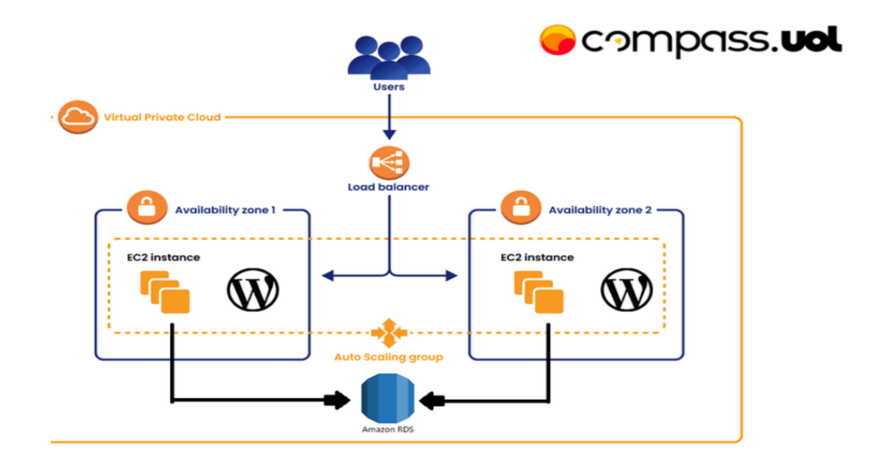

## 🛠️ Requisitos Técnicos  
- **Windows 11**  
- **Visual Studio Code**
- **Amazon Linux 2023**  
- **Instância EC2 AWS**   
- **AWS RDS**   
- **AWS EFS**   
- **Classic Load Balancer**   
- **Cloud Watch**   


### 🔹 Tecnologias Utilizadas  
<p align="left">
  <a href="https://www.linux.org/" target="_blank">
    
  </a>
  <a href="https://aws.amazon.com/" target="_blank">
    
  </a>
  <a href="https://aws.amazon.com/ec2/" target="_blank">
    
  </a>
  <a href="https://aws.amazon.com/rds/" target="_blank">
    
  </a>
  <a href="https://aws.amazon.com/efs/" target="_blank">
    
  </a>
  <a href="https://aws.amazon.com/elasticloadbalancing/classic-load-balancer/" target="_blank">
    
  </a>
  <a href="https://aws.amazon.com/cloudwatch/" target="_blank">
    
  </a>
</p>


## 📑 Índice  
1. [Criar VPC](#1-criar-uma-vpc-na-aws)
2. [Security Groups](#2-security-groups)
3. [Criar um banco de dados MySQL no Amazon RDS](#3-criar-um-banco-de-dados-mysql-no-amazon-rds)
4. [Criar um volume EFS ](#4-criar-um-volume-efs)
5. [Criar um template](#5-criar-um-template)
6. [Criar um Classic Load Balancer](#6-criar-um-classic-load-balancer)
7. [Criar o Auto Scaling Group](#7-criar-o-auto-scaling-group)
8. [Criar alarme no CloudWatch](#8-criar-alarme-no-cloudwatch)
9. [Acessar a aplicação via DNS](#9-acessar-a-aplicação-via-dns)
10. [Conclusão](#10-conclusão)

## 1. Criar uma VPC na AWS  
O primeiro passo para configurar seu ambiente na AWS é criar uma VPC personalizada. No console da AWS, pesquise pelo serviço **VPC** e crie uma nova, de acordo com as orientações abaixo  

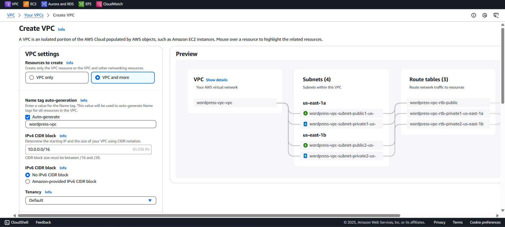
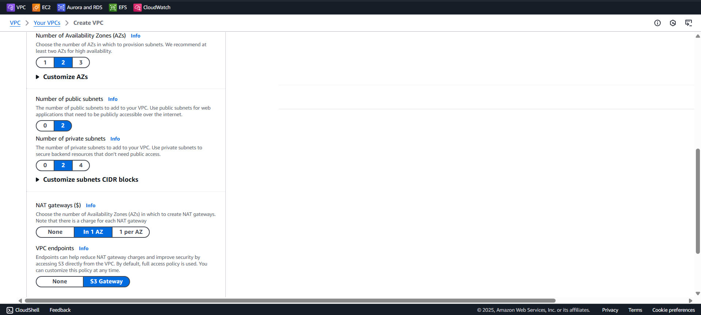

 Como eu não queria expor as minhas futuras instâncias diretamente com IP público, eu precisei configurar um NAT Gateway nas subnets públicas. Ele permite que as instâncias privadas façam requisições pra internet sem precisar de um IP público. Então, a comunicação de saída é permitida, mas a entrada só acontece através do Load Balancer

Após a criação da VPC, ela ficará assim
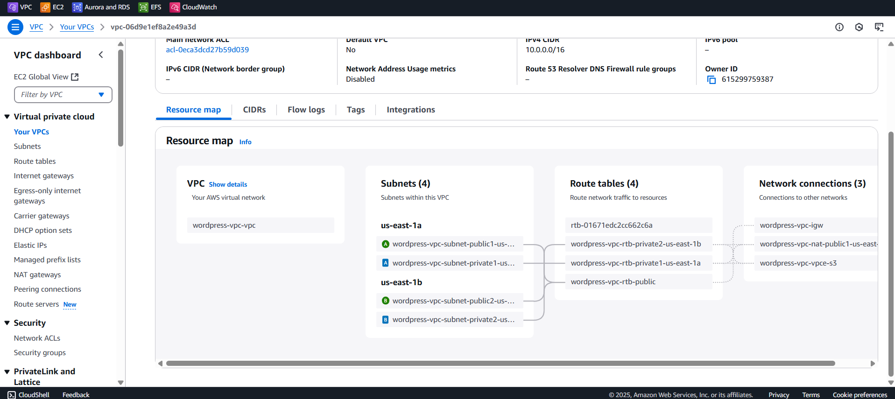


## 2. Security Groups
Os security groups servem pra controlar o tráfego que pode entrar e sair dos recursos na VPC, funcionando como firewalls que permitem ou bloqueiam conexões específicas com base em regras que eu defino.

Vá até **EC2 -> Security groups**, e então crie:
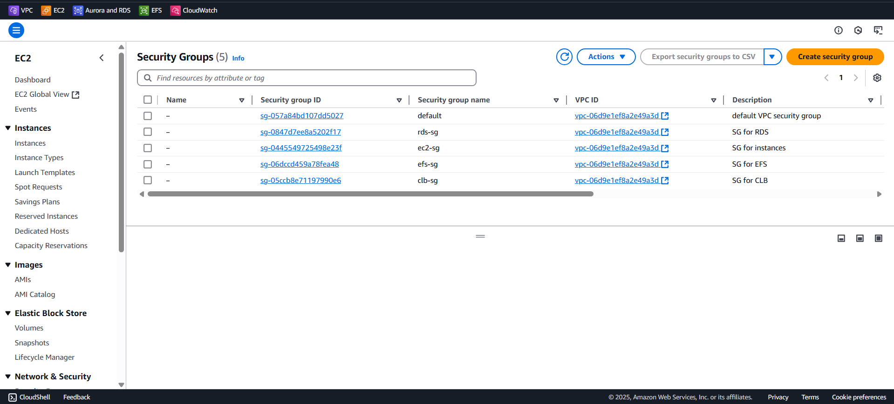

### 2.1 Criar Security Group para o Amazon RDS
No console da AWS, acesse **EC2 → Security Groups** defina as seguintes regras para o security group do banco de dados: 

✅ **Regra de entrada:**  
   - **MySQL/Aurora (porta 3306)** -> Permite tráfego do Security Group da instância EC2

✅ **Regra de saída:**  
   - Permitir todo o tráfego de saída (padrão)

### 2.2 Criar Security Group para EC2  
No console da AWS, acesse **EC2 → Security Groups** defina as seguintes regras para o security group das instâncias: 

✅ **Regra de entrada:**   
   - **NFS (porta 2049)** → Permite para o grupo de segurança da EC2
   - **HTTP (port 80)** → Permite para o grupo de segurança do Load Balancer 

✅ **Regra de saída:**   
   - **HTTPS (port 443)** → Permite para qualquer lugar
  - **MYSQL/Aurora (port 3306)** → Permite tráfego para o grupo de segurança do RDS
  - **NFS (port 2049)** → Permite tráfego para o grupo de segurança do EFS


### 2.3 Criar Security Group para o Amazon EFS  
No console da AWS, acesse **EC2 → Security Groups** defina as seguintes regras para o security group do volume EFS: 

✅ **Regra de entrada:**   
   - **NFS (porta 2049)** → Permite apenas o acesso do grupo de segurança utilizado para a instância.  
   
✅ **Regra de saída:**  
   - Permitir todo o tráfego de saída (padrão)


### 2.4 Criar security group para o Load Balancer  
No console da AWS, acesse **EC2 → Security Groups** defina as seguintes regras para o security group do classic load balancer: 

✅ **Regra de entrada:**   
   - **HTTP (porta 80)** → Permite para qualquer lugar  
   
✅ **Regra de saída:**  
   - **HTTP (port 80)** → Permitir tráfego para o security group das instâncias


## 3. Criar um banco de dados MySQL no Amazon RDS
Configure o Aurora RDS para ter um banco de dados gerenciado com bom desempenho e fácil escalabilidade. Desabilite o backup automático porque, para o que estamos implementando no momento, não é necessário e pode gerar custos desnecessários

No console da AWS, pesquise pelo serviço `Aurora and RDS` e crie um novo database, de acordo com as orientações abaixo:

1. Selecione MySQL como o tipo de banco de dados. Escolha a versão mais recente disponível.
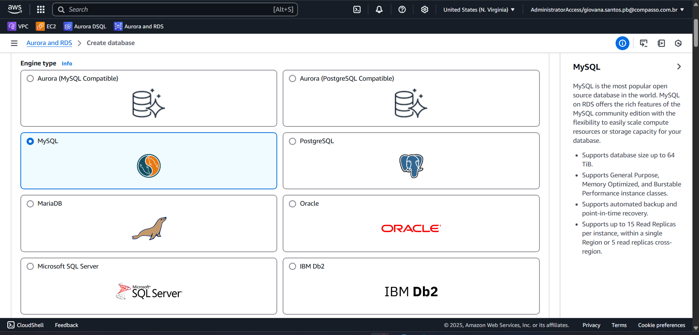

2. Marque a opção Free Tier para evitar cobranças.
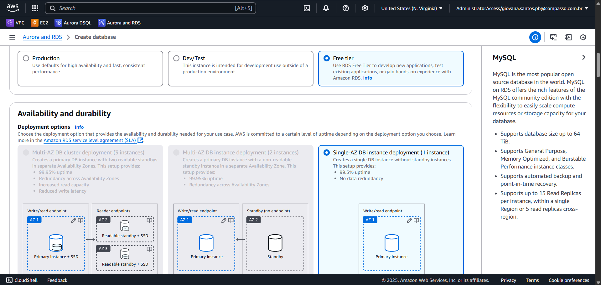

3. Defina um ID único para o banco de dados.
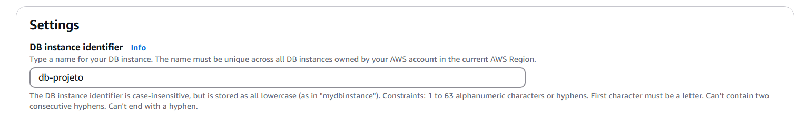

4. Forneça um nome de usuário, assim como sua própria senha em `Self managed`
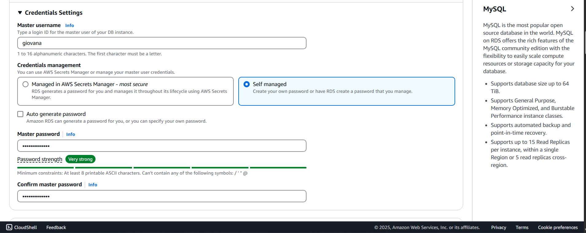

5. Escolha a instância do tipo db.t3.micro.
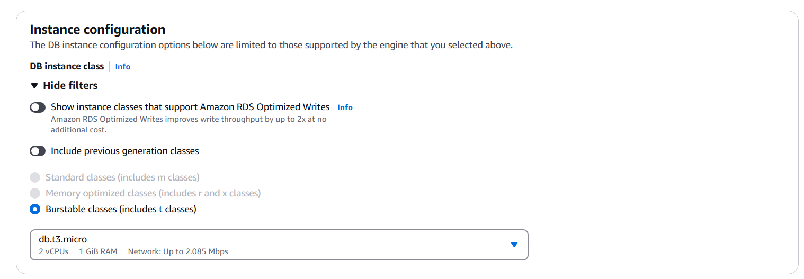

6. Na aba `Storage`, clique em `Additional storage configuration` e defina o tamanho máximo como 22GB.
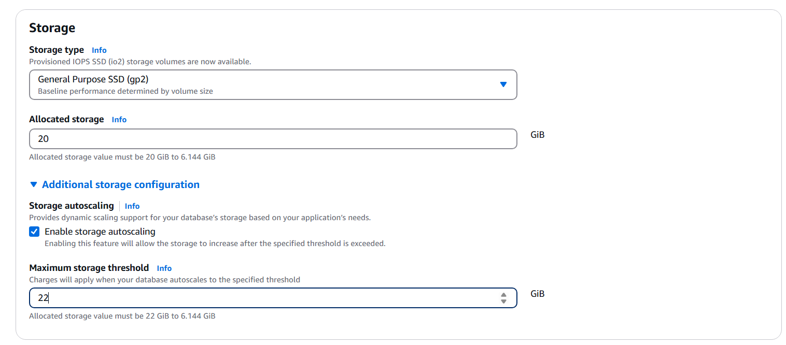

7. Na aba `Connectivity`, escolha `Don’t connect to an EC2 compute resource`. 
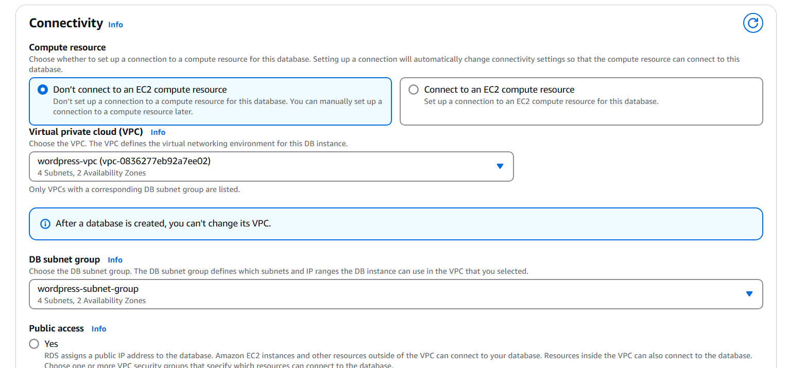


> **Nota de Atenção**:  
> Selecione a mesma VPC e subnet utilizadas na sua instância EC2 para permitir a comunicação entre elas.

8. Por fim, na aba `Additional configuration`, dê um nome ao seu database. 
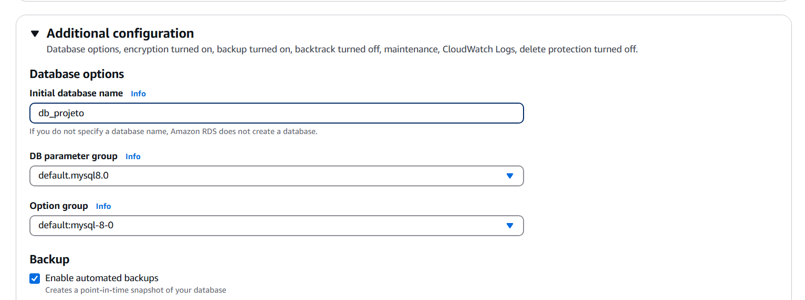


## 4. Criar um volume EFS 
Crie o EFS pra ter um sistema de arquivos compartilhado que todas as instâncias EC2 podem acessar ao mesmo tempo. Coloque-o nas subnets privadas pra garantir mais segurança e evitar exposição direta na internet.

No console da AWS, pesquise pelo serviço `EFS` e crie um novo file system, de acordo com as orientações abaixo:

1. Dê um nome ao file system e o coloque na VPC criada anteriormente. Depois clique em `Customize`. 
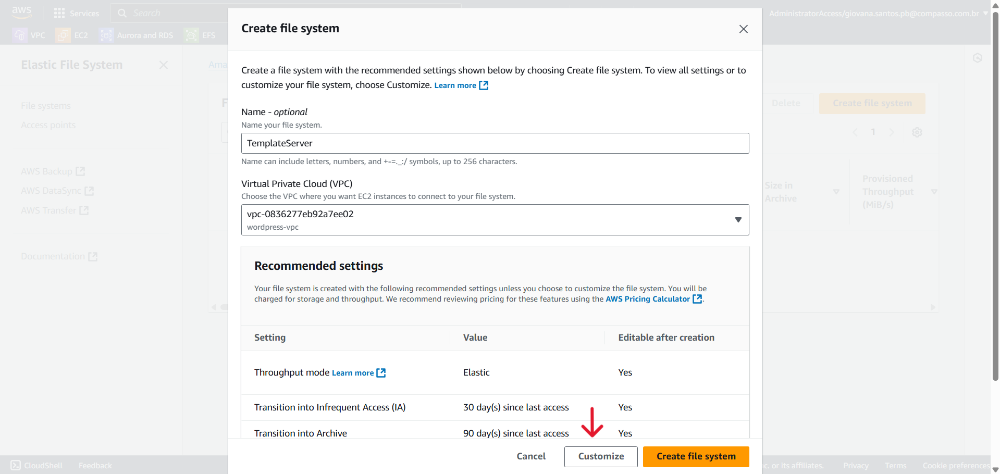

2. Em `General` apenas desabilite a opção de backups automáticos.
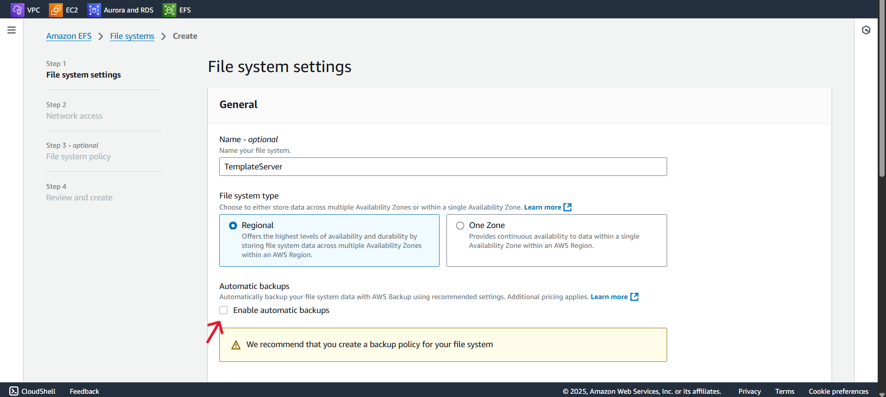

3. Em `Lifecycle Management` mude tudo para `None`, para evitar que dados sejam movidos automaticamente pra classes de armazenamento mais baratas, já que queremos um banco consistente.
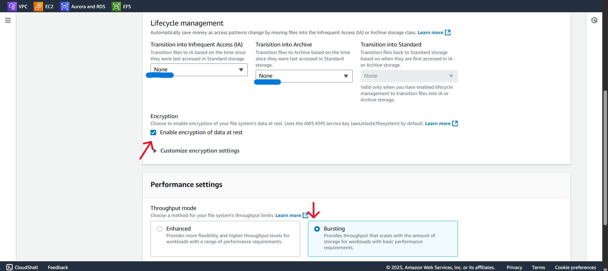

4. Em `Performance settings`, mude para `Bursting`, é o suficiente pra lidar com picos de tráfego sem custo extra. Em seguida, avance.
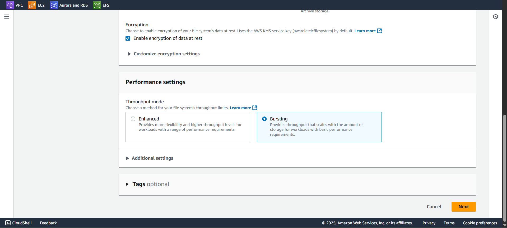

5. Em `Network`, dexei dois `Mount targets`. Um em cada zona de disponibilidade, na subnet privada, apontando para o security group do EFS. Isso garente a alta disponibilidade e acesso consistente ao EFS pelas instâncias EC2, mesmo sem usar IP público. Eles ficam protegidos pelo Security Group do EFS, permitindo acesso apenas das instâncias autorizadas dentro da VPC.
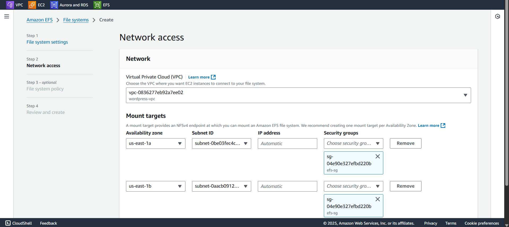

6. Por fim, crie o EFS

## 5. Criar um template 
Crie um Launch Template para padronizar a configuração das instâncias EC2, garantindo que todas iniciem com as mesmas especificações, segurança e aplicações necessárias, sem precisar configurar tudo manualmente cada vez.

Acesse **EC2 -> Launch Template**.

1. Insira uma nome e uma descrição para o template
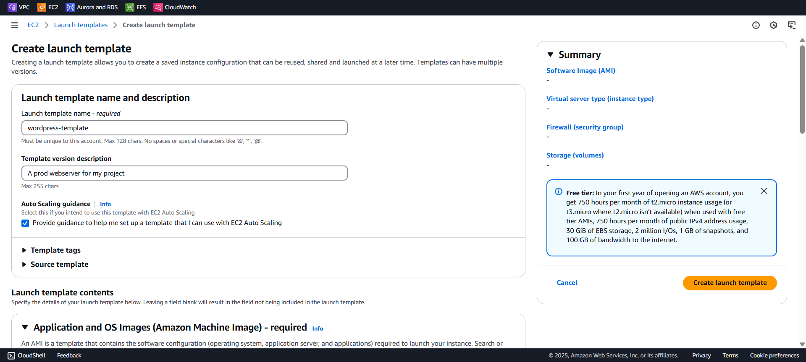

2. Selecione a AMI desejada
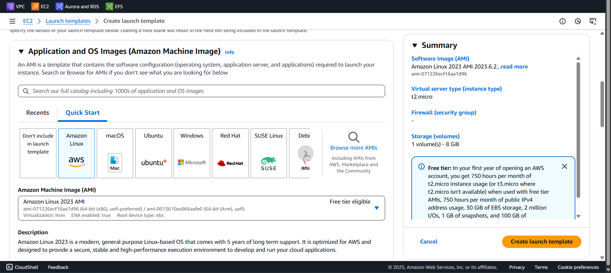

3. Defina o tipo da instância como `t2.micro` e uma chave SSH.
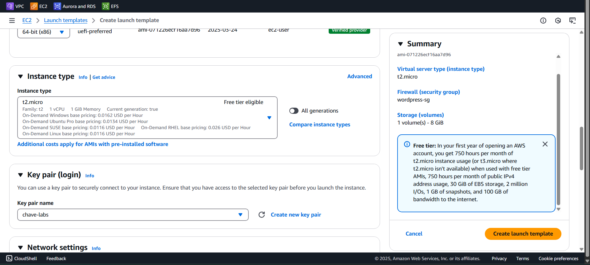

4. Nas configurações de rede, selecione apenas o security group criado para as instâncias 
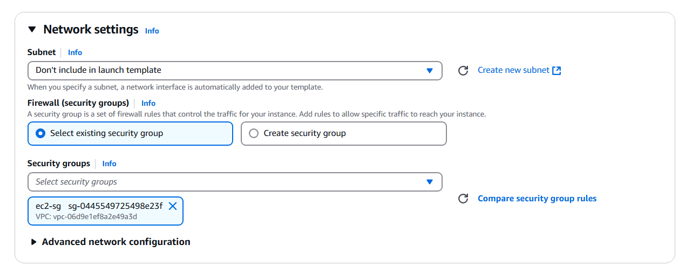

5. Por fim adicione o seu scrip `userdata.sh` na aba de `Advanced details` 
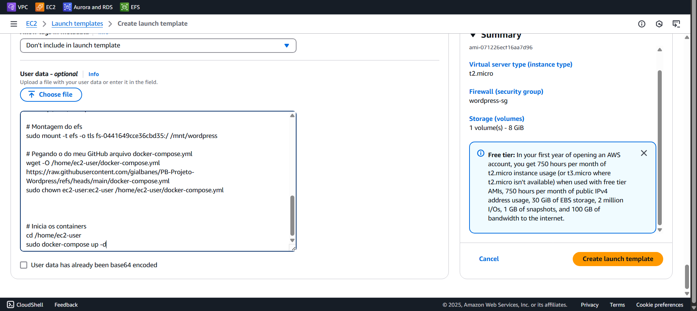

A seguir o script utilizado 
```bash
#!/bin/bash

# Atualiza pacotes
sudo yum update -y

# Instalação do Docker e habilitação do serviço
sudo yum install -y docker
sudo systemctl start docker
sudo systemctl enable docker
sudo docker --version

# Instalação do wget e efs-utils
sudo yum install wget -y
sudo yum install amazon-efs-utils -y

# Instalação do docker-compose e fornecendo permissão de execução à ele
sudo curl -L "https://github.com/docker/compose/releases/latest/download/docker-compose-$(uname -s)-$(uname -m)" -o /usr/local/bin/docker-compose
sudo chmod +x /usr/local/bin/docker-compose


# Criando um diretório 
mkdir -p [nome da pasta]

# Montagem do efs a partir da pasta criada
[link do seu volume efs] [nome da pasta]

# Pegando o arquivo docker-compose.yml do meu GitHub 
wget -O /home/ec2-user/docker-compose.yml [link do docker-compose no seu github (raw)]
sudo chown ec2-user:ec2-user /home/ec2-user/docker-compose.yml


# Inicia os containers
cd /home/ec2-user
sudo docker-compose up -d --build 
```

A seguir o conteúdo do meu docker-compose
```bash
services:

  wordpress:
    image: wordpress
    restart: always
    ports:
      - "80:80"
    environment:
      WORDPRESS_DB_HOST: endpoint do seu banco
      WORDPRESS_DB_USER: nameUser
      WORDPRESS_DB_PASSWORD: passwordUser
      WORDPRESS_DB_NAME: nameDB
    networks:
      - rede
    volumes:
      - /home/ec2-user[sua pasta]:/var/www/html


networks:
  rede:
   driver: bridge
```

## 6. Criar um Classic Load Balancer 
Crie um Load Balancer para distribuir o tráfego de rede entre as instâncias EC2 de forma equilibrada, mantendo as instâncias privadas sem IP público.

No seu console AWS, vá até **EC2 -> Load Balancer** 

Para fins didáticos, foi solicitado que fosse criado um classic load balancer
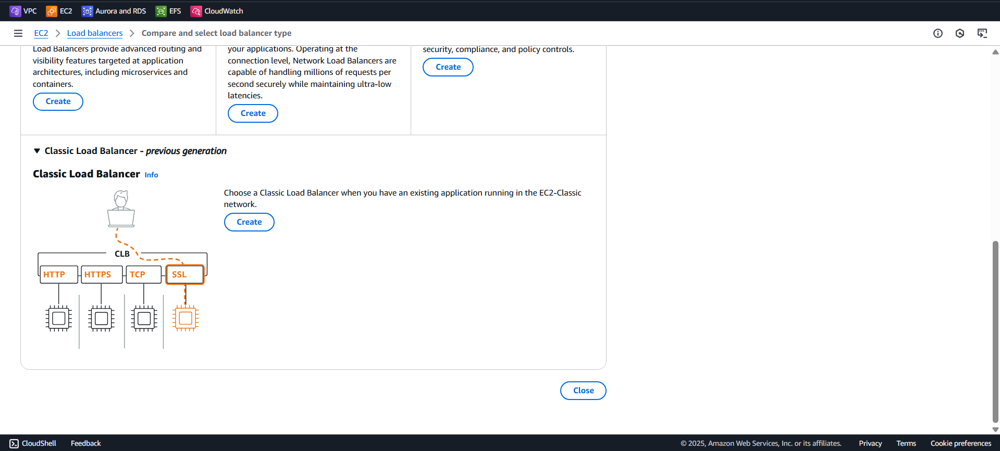

Dê um nome ao load balancer
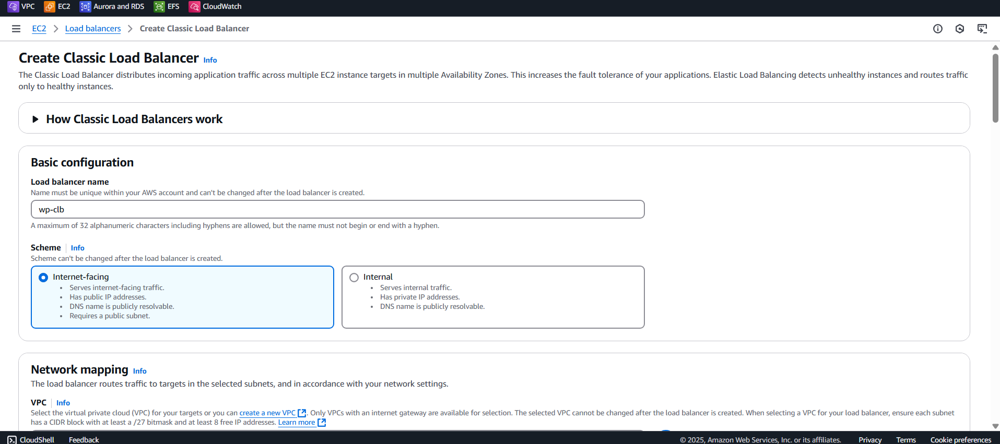

Coloque o Load Balancer nas subnets públicas de cada zona de disponibilidade para garantir que ele receba tráfego da internet e distribua para as instâncias EC2, independente da zona em que elas estejam.
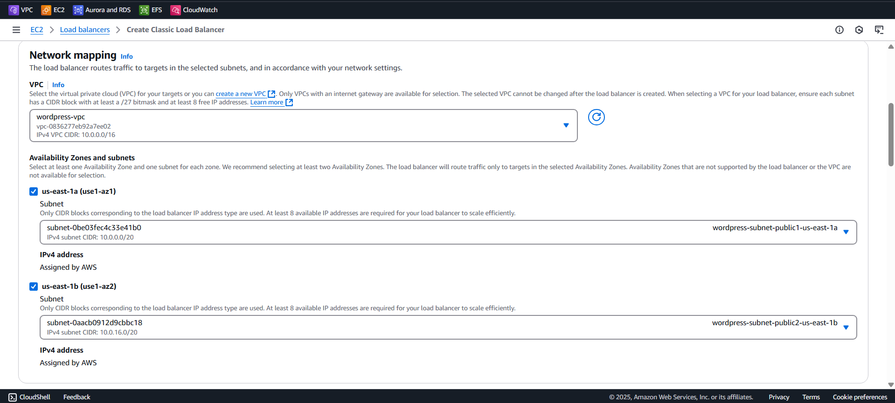

Escolha o security group criado para o classic load balancer
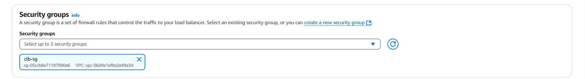

Coloque um listener na porta 9090 pra o Load Balancer escutar tráfego específico do WordPress e deixe o ping path como `/wp-admin/install.php` pra checar se o site tá funcionando corretamente.
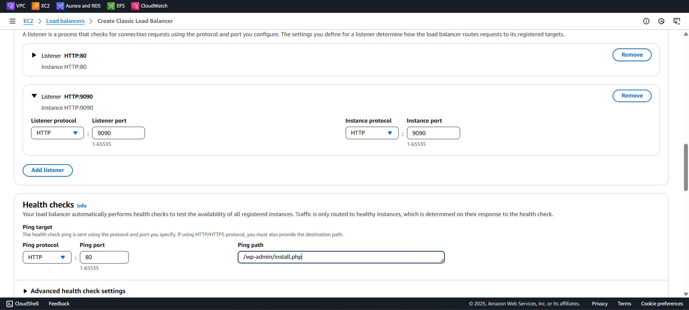


## 7. Criar o Auto Scaling Group 
Crie um Auto Scaling Group pra garantir que sempre tenha instâncias EC2 suficientes rodando pra suportar o tráfego. Ele aumenta ou diminui a quantidade de instâncias automaticamente, de acordo com a demanda.

1. Insira um nome para o seu grupo de scaling, e como template, o criado anteriormente
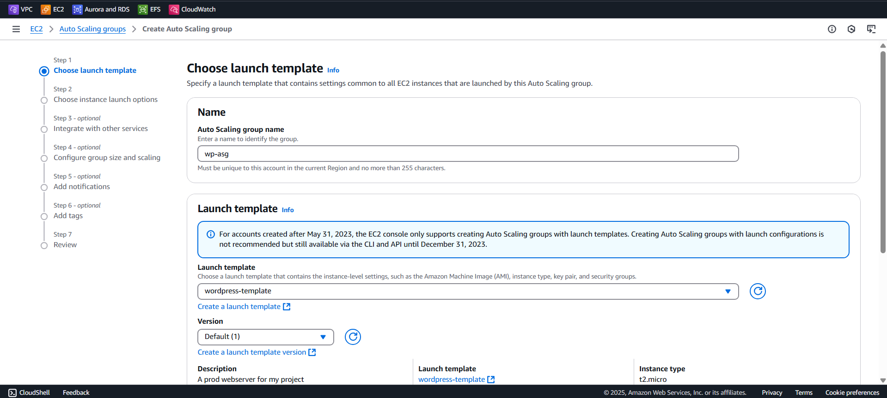

2. Selecione a VPC criada e as duas subnets privadas, porque as instâncias EC2 que ele cria não precisam ser expostas diretamente, já que recebem as requisições do load balancer
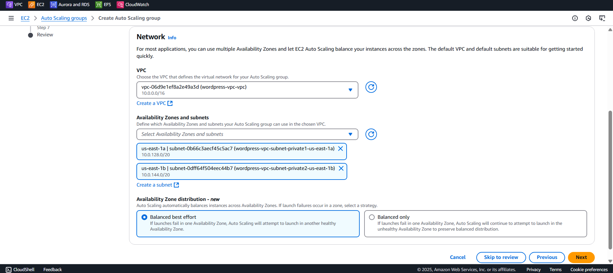

3. Agora, escolha anexar um load balancer já existente, nesse caso, o classic load balancer criado anteriormente
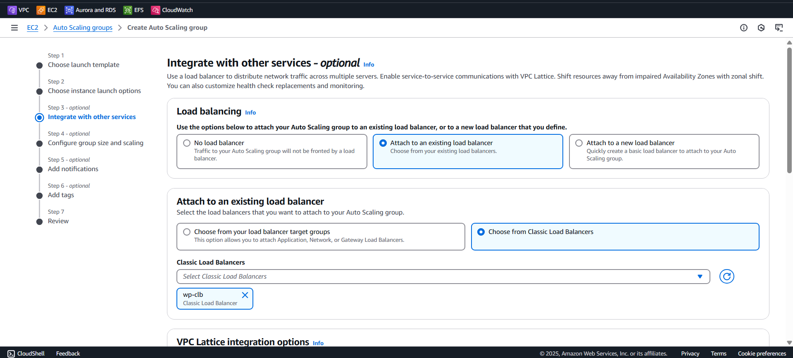

5. Marque a opção de `Health checks`
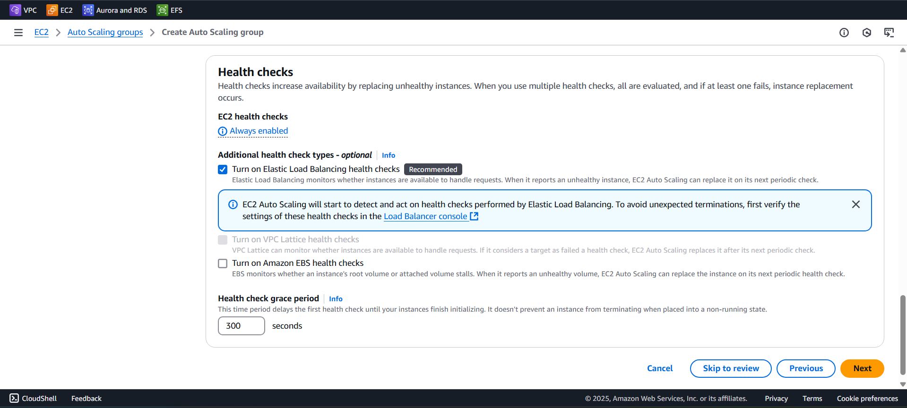

6. Defina o Group Size como 2, 2, 4 para garantir que sempre tenha pelo menos duas instâncias rodando (mínimo e desejado como 2) e, se precisar escalar, ele pode ir até quatro instâncias (máximo como 4)
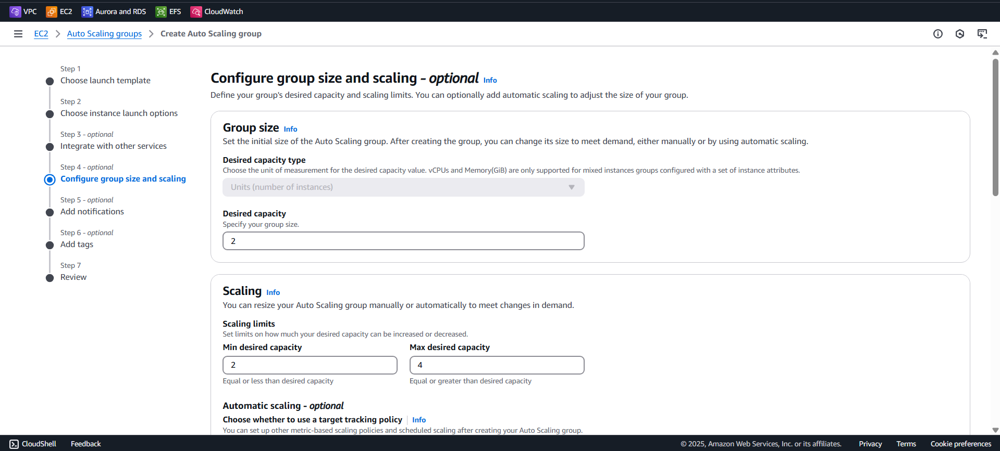

7. Deixe sem política de escalonamento por enquanto porque vamos criar depois uma política simples, que é a que funciona com os alarmes do CloudWatch
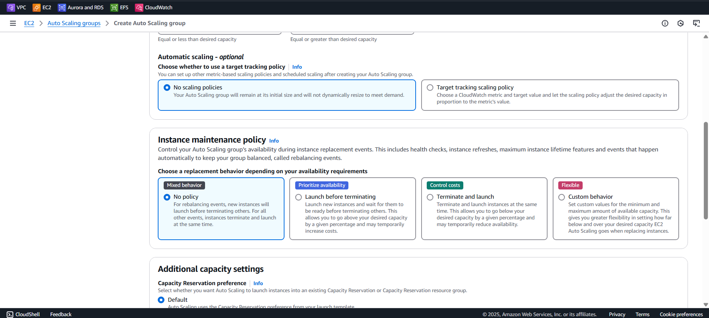

8. Depois, habilite a opção de métricas do CloudWatch
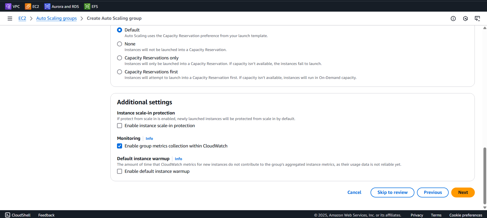

9. Por fim, adicione a TAG name com o nome de suas instâncias que serão lançadas
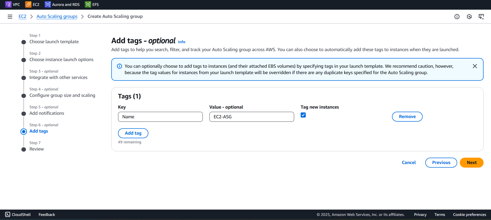

10. Depois de criar o auto scaling group, o selecione vá até a aba de `Automatic Scaling`. Crie um novo scaling dinâmico. Configure uma política de escalonamento simples na aba de Automatic Scaling, porque é compatível com os alarmes do CloudWatch
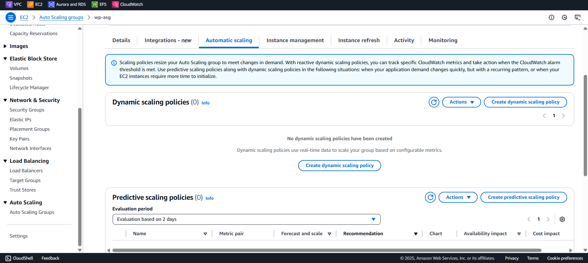

11. Configure a ação para adicionar 2 capacity units quando o alarme de CPU Utilization for ativado, ou seja, ele aumenta a capacidade do Auto Scaling Group em duas instâncias sempre que a utilização de CPU ultrapassar o limite definido.
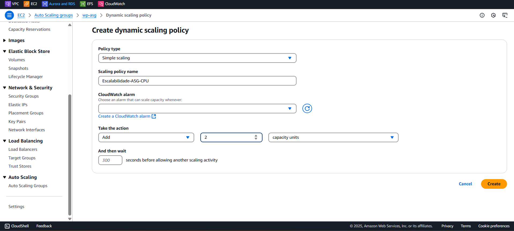


---

### 8. Criar alarme no CloudWatch
Crie um alarme no CloudWatch para monitorar a métrica de utilização de CPU e executar ações quando o limite for atingido

Vamos monitorar a métrica de CPU Utilization pelo Auto Scaling Group porque ele é responsável por gerenciar as instâncias EC2 que vão escalar o ambiente.

Então, clique em selecionar a métrica
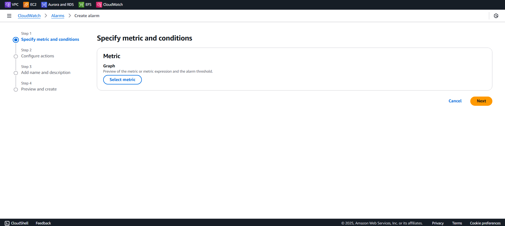

Escolha EC2
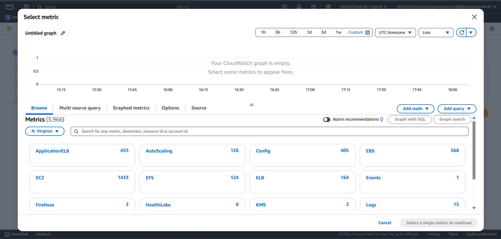

Faremos o monitoramento pelo auto scaling group 


Escolha pela utilização de CPU
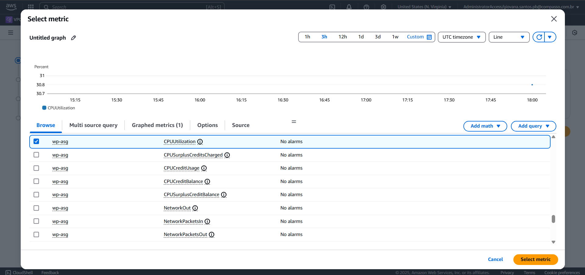

Aqui foi definido que quando a utilização da CPU for igual ou maior que 95%, uma nova instância é lançada


Remova essa ação
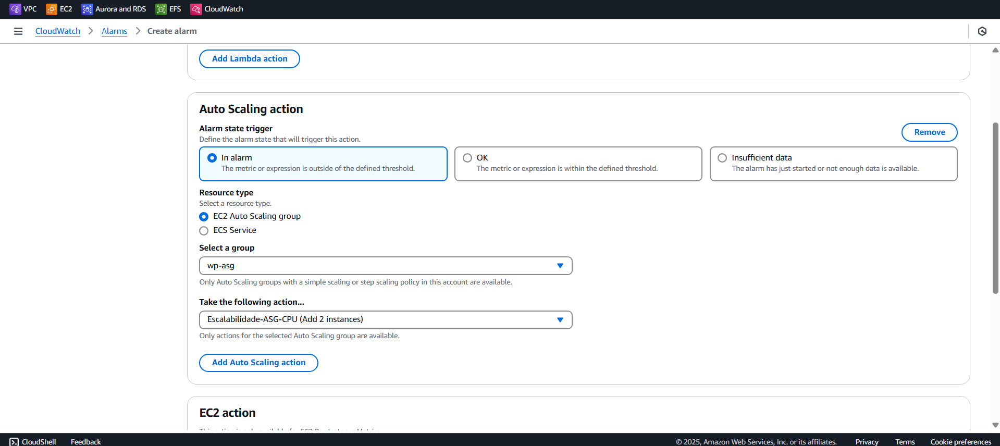

Escolha criar uma nova ação de auto scaling a partir da política criada em 7.11


Pronto, o alarme foi criado e agora irá monitorar a utilização de CPU e acionar o escalonamento automaticamente quando atingir o limite definido

### 9. Acessar a aplicação via DNS
Em **EC2 -> Instances**, é possível notar que duas instâncias foram criadas. É importante verificar se uma foi criada na us-east-1a e outra na us-east-1b
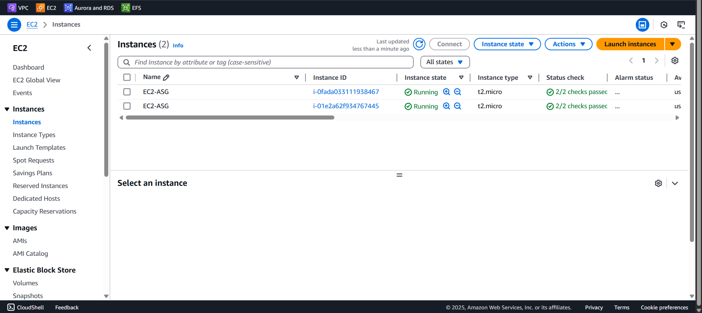

Vá até **EC2 -> Load Balancer** e clique em cima do que está criado. Depois, copie o DNS name e cole no navegador
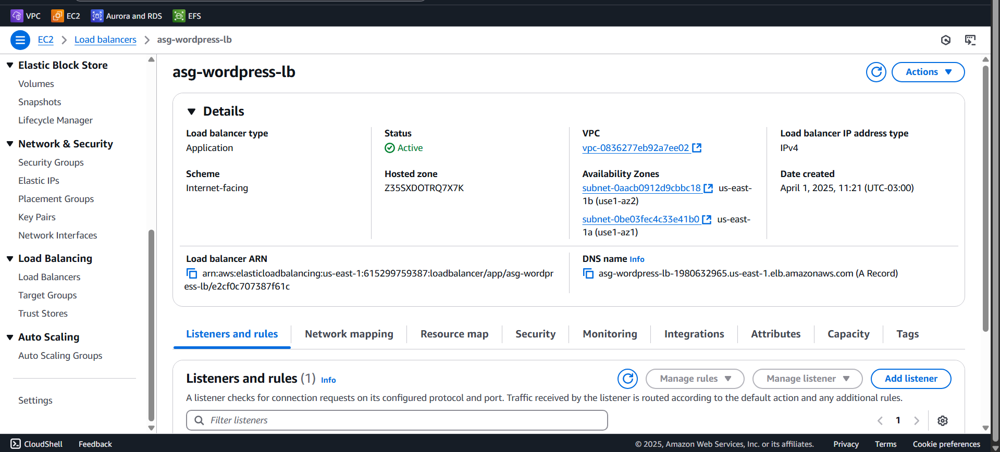

Essa tela deve ser exibida 
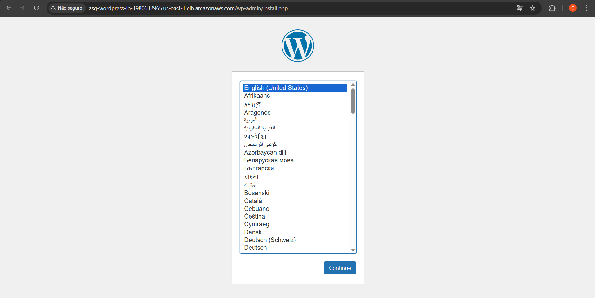

Após a instalação do Wordpress, você terá acesso à essa página
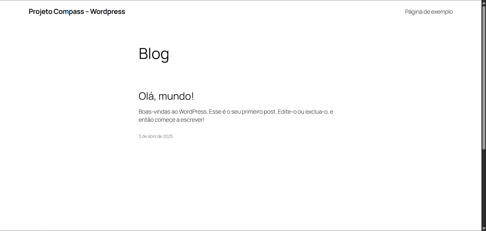

### 10. Conclusão
O projeto de implantação do WordPress na AWS usando Docker, RDS, EFS e Load Balancer mostrou que é possível criar um ambiente seguro, escalável e com boa disponibilidade para hospedar aplicações web. A arquitetura conseguiu separar bem a aplicação e o banco de dados, com o Amazon RDS facilitando o gerenciamento dos dados e o EFS permitindo que várias instâncias EC2 compartilhem arquivos sem complicação. O Load Balancer ajudou na distribuição do tráfego de forma eficiente, mantendo um desempenho estável mesmo com picos de acesso.

A automação com templates e scripts de inicialização simplificou a configuração das instâncias EC2, evitando erros manuais e garantindo consistência no ambiente. A monitoração feita com o CloudWatch reforçou a segurança e a estabilidade do sistema, facilitando a detecção e resposta a problemas.


