# DevSecOps - Projeto Wordpress na AWS

 **Documentação do segundo projeto proposto na trilha de DevSecOps no meu programa de estágio PB - 2025**  

## 🎯 Objetivo  
Desenvolver e testar habilidades em **Linux**, **AWS** e **automação de processos** através da configuração de um ambiente de servidor web monitorado.

## 🛠️ Requisitos Técnicos  
- **Windows 11**  
- **Amazon Linux 2023**  
- **Instância EC2 AWS**  
- **Nginx**  


### 🔹 Tecnologias Utilizadas  
<p align="left">
  
  
  
  

</p>


## 📑 Índice  
1. [Configuração do Ambiente](#1-configuração-do-ambiente) 
2. [Intalação e configuração do Docker](#2-intalação-e-configuração-do-docker)

## 1. Configuração do ambiente 

### 1.1 Criar uma VPC na AWS  
O primeiro passo para configurar seu ambiente na AWS é criar uma VPC personalizada. No console da AWS, pesquise pelo serviço **VPC** e crie uma nova, definindo um **bloco CIDR** adequado para sua rede (por exemplo, `10.0.0.0/16` permite criar até 65.536 endereços IP privados dentro dessa VPC).  

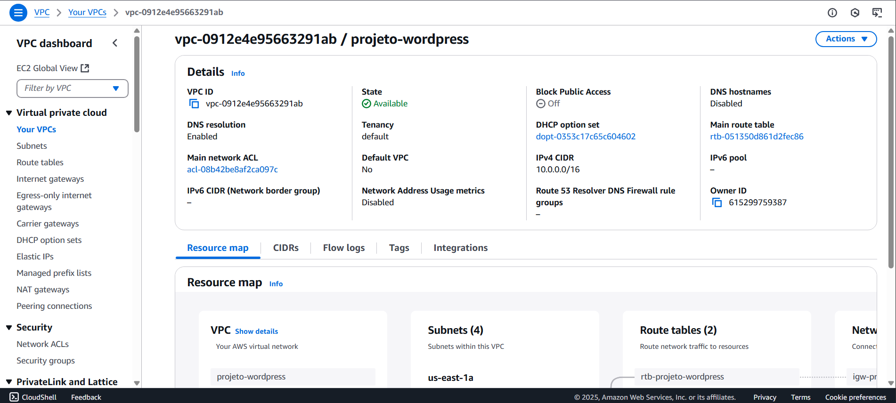

Após criar a VPC, será necessário configurar as **subnets**, que são divisões menores dentro da VPC. As subnets permitem organizar os recursos e distribuir a carga de trabalho em diferentes zonas de disponibilidade.  

1️⃣ Acesse a seção de Subnets no console da AWS

2️⃣ Crie quatro subnets:  
   - **Duas públicas** (acessíveis pela internet)  
   - **Duas privadas** (acessíveis apenas dentro da VPC) 

3️⃣ Distribua as subnets entre diferentes zonas de disponibilidade, por exemplo:  
   - **us-east-1a** → 1 subnet pública e 1 privada  
   - **us-east-1b** → 1 subnet pública e 1 privada  

Isso melhora a **alta disponibilidade** do ambiente, garantindo que, caso uma zona fique indisponível, a outra ainda estará funcionando.  

Após a criação, as subnets aparecerão listadas no console da AWS:  

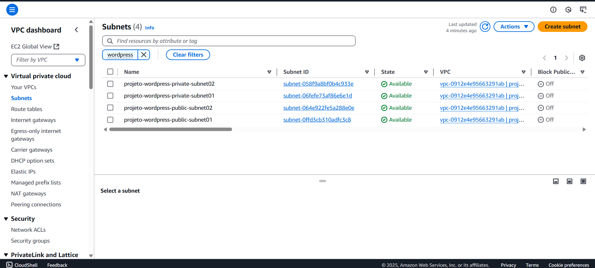 

---

#### 🔹 Configurar Acesso à Internet  

Por padrão, uma VPC recém-criada não tem conexão direta com a internet. Para permitir que as **subnets públicas** acessem a internet (e sejam acessadas externamente), precisamos configurar dois elementos fundamentais:  

✅ **Internet Gateway (IGW)** → Responsável por fornecer acesso à internet para os recursos da VPC  
✅ **Route Table** → Controla como o tráfego é roteado dentro da VPC  

#### 🔹 Criando um Internet Gateway  
O **Internet Gateway (IGW)** é um componente que permite que recursos dentro da VPC se comuniquem com a internet. Sem ele, mesmo que a instância tenha um IP público, não será possível acessar nada externo.  

1️⃣ No console da AWS, vá até **Internet Gateway** e clique em **Criar Internet Gateway**.  
2️⃣ Após a criação, é necessário anexá-lo à VPC clicando em **Attach to VPC**.  

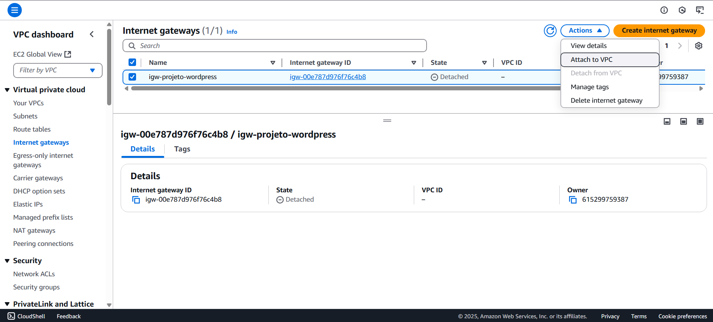 

#### 🔹 Criando uma Route Table  
A **Route Table** define quais caminhos (rotas) o tráfego de rede deve seguir dentro da VPC. Por padrão, todas as subnets criadas usam a **route table principal**, que só permite comunicação interna.  

Para permitir que as **subnets públicas** acessem a internet:  

1️⃣ Vá até **Route Tables** no console da VPC e crie uma nova tabela de rotas.  
2️⃣ Adicione uma **rota com destino `0.0.0.0/0`** apontando para o **Internet Gateway (IGW)** criado anteriormente. Isso garante que qualquer tráfego externo será roteado para a internet.  

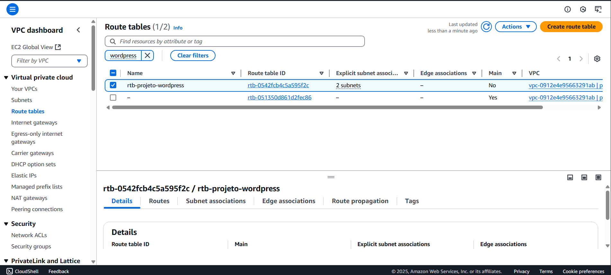 
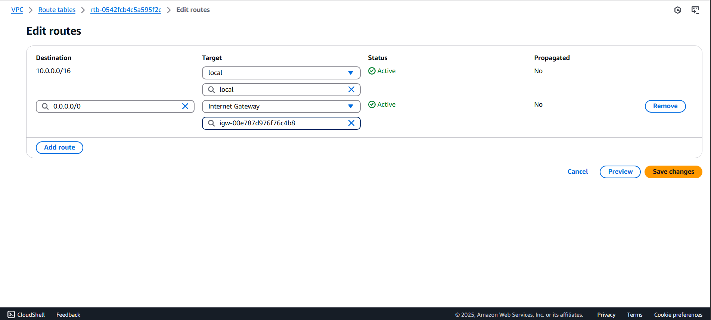  

3️⃣ Agora, associe as **subnets públicas** a essa nova Route Table:  
   - Vá até **Subnet Associations**  
   - Edite e selecione as duas **subnets públicas**  

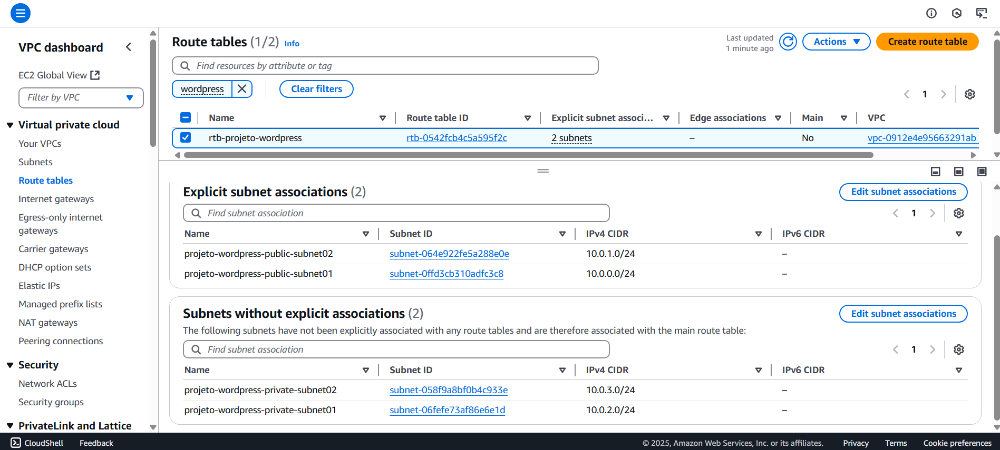 

Agora, suas **subnets públicas** podem acessar a internet!  

### 1.2 Criar uma instância EC2  
Com a VPC configurada, podemos criar uma **instância EC2**, que será o servidor web do nosso projeto.  

Antes disso, é essencial configurar um **Security Group**, que atua como um firewall controlando o tráfego de entrada e saída da instância.  

#### 🔹 Criando um Security Group  
No console da AWS, acesse **EC2 → Security Groups** e crie um novo com as seguintes regras:  

✅ **Regra de entrada:**  
   - **HTTP (porta 80)** → Permite tráfego de qualquer origem (`0.0.0.0/0`)  
   - **SSH (porta 22)** → Permite apenas o acesso do seu IP (`Meu IP`) para garantir segurança  

✅ **Regra de saída:**  
   - Permitir todo o tráfego de saída (padrão)

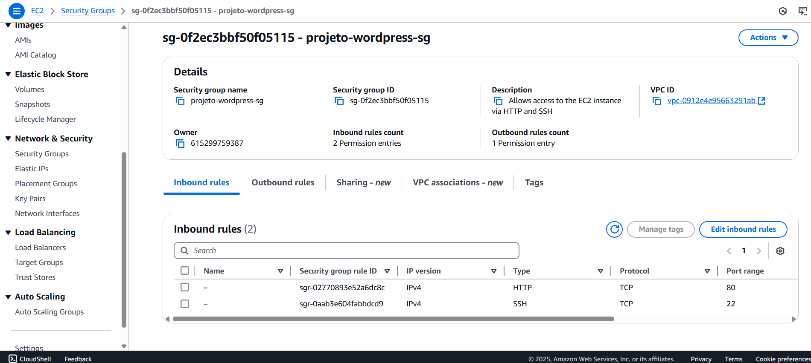 

Agora podemos criar a instância EC2:  

1️⃣ No console da AWS, vá até **EC2 → Instâncias** e clique em **Criar Instância**  
2️⃣ Escolha a **AMI Amazon Linux 2023**  
3️⃣ **Configure uma chave SSH** para permitir acesso remoto à instância 

4️⃣ Configure as opções de rede:  
   - Selecione a **VPC criada** anteriormente  
   - Escolha uma **subnet pública**  
   - Ative o **IP público automático**  
   - Associe o **Security Group** criado  


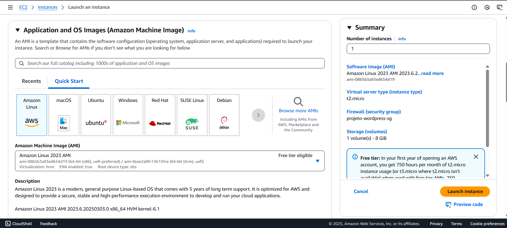  
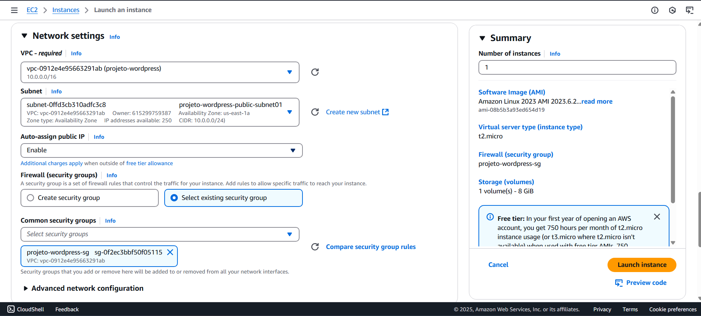 

---

### 1.3 Acessar a instância via SSH  

Agora que a EC2 está criada, podemos acessá-la via **SSH**.  

No console da AWS, selecione a instância e clique em **Connect**. A AWS fornecerá instruções para conexão via terminal:  


> **Nota de Atenção**:  
> Os comandos descritos foram executados no terminal do Visual Studio Code, localizado na pasta onde a chave SSH foi baixada. Certifique-se de estar na pasta correta com a chave SSH configurada para garantir que todas as conexões e comandos relacionados ao seu servidor EC2 funcionem corretamente.

Antes de conectar, precisamos alterar as permissões da chave SSH,  deixando a chave acessível apenas para o proprietário (400 significa somente leitura para o dono), com o comando:  
```bash
chmod 400 "suaChave.pem"
```

Agora podemos conectar à EC2 executando:
```bash
ssh -i "suaChave.pem" ec2-user@IpPublicoDaEC2
```

Caso tudo esteja certo, veremos a tela de conexão:


## 2. Intalação e configuração do Docker
Para instalar o Docker, dentro da instância execute: 

```bash
sudo yum install -y docker 
```
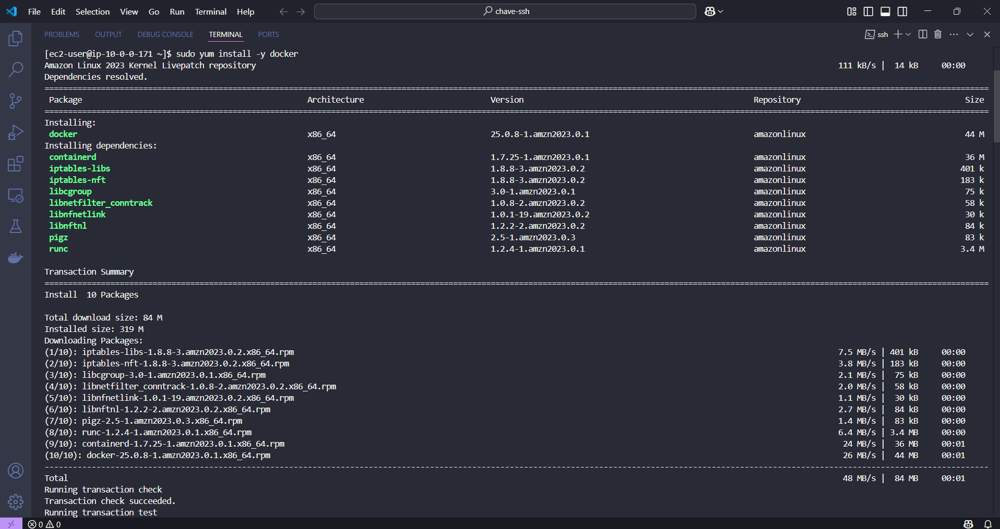

Para confirmar, verifique a versão do docker com:
```bash
docker --version 
```
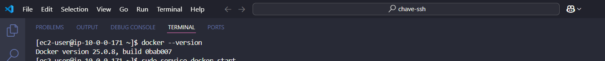

Em seguida, inicie o serviço do docker com: 
```bash
sudo service docker start
```
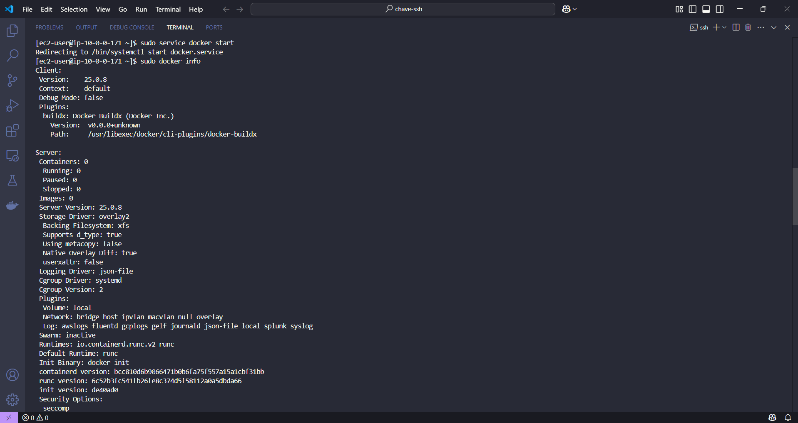

Para confirmar, veja se o serviço está rodando:
```bash
systemctl status docker 
```
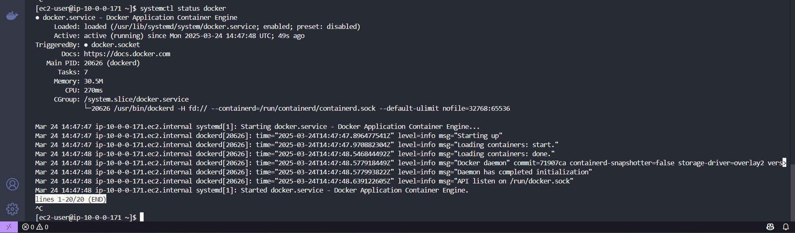

Agora, é necessário isntalar o docker-compose, para isso, execute:
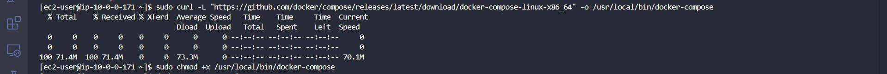

Por fim, instale a imagem do Wordpress com: 
```bash
docker pull wordpress
```

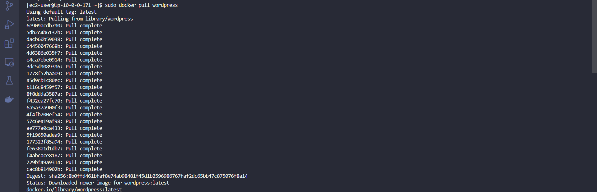

Crie um espaço de trabalho para o Wordpress:
```bash
mkdir wordpress
```

Dentro dessa pasta, crie um arquivo `docker-compose.yml`, para iniciar dois serviços, o do Wordpress e de banco de dados, com o seguinte conteúdo: 

```bash
sudo nao docker-compose.yml
```

```bash
services:

  wordpress:
    image: wordpress
    restart: always
    ports:
      - 8080:80
    environment:
      WORDPRESS_DB_HOST: db
      WORDPRESS_DB_USER: exampleuser
      WORDPRESS_DB_PASSWORD: examplepass
      WORDPRESS_DB_NAME: exampledb
    volumes:
      - wordpress:/var/www/html

  db:
    image: mysql:8.0
    restart: always
    environment:
      MYSQL_DATABASE: exampledb
      MYSQL_USER: exampleuser
      MYSQL_PASSWORD: examplepass
      MYSQL_RANDOM_ROOT_PASSWORD: '1'
    volumes:
      - db:/var/lib/mysql

volumes:
  wordpress:
  db:
```

Construa o container a partir do docker-compose:
```bash
sudo docker-compose up -d --build
```

Por fim, rode o container:
```bash
sudo docker run -d -it wordpress
```

Para testar, abra o navegador e digite `localhost:8080`

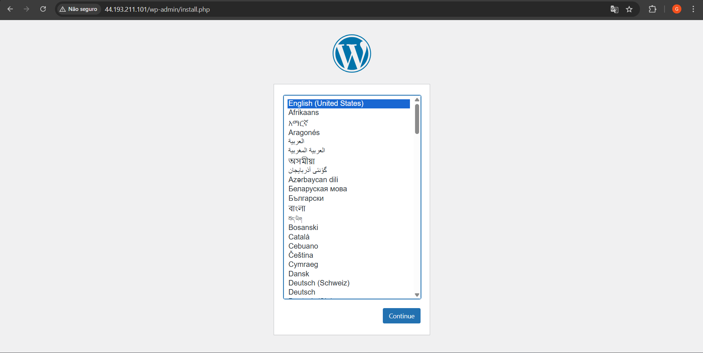